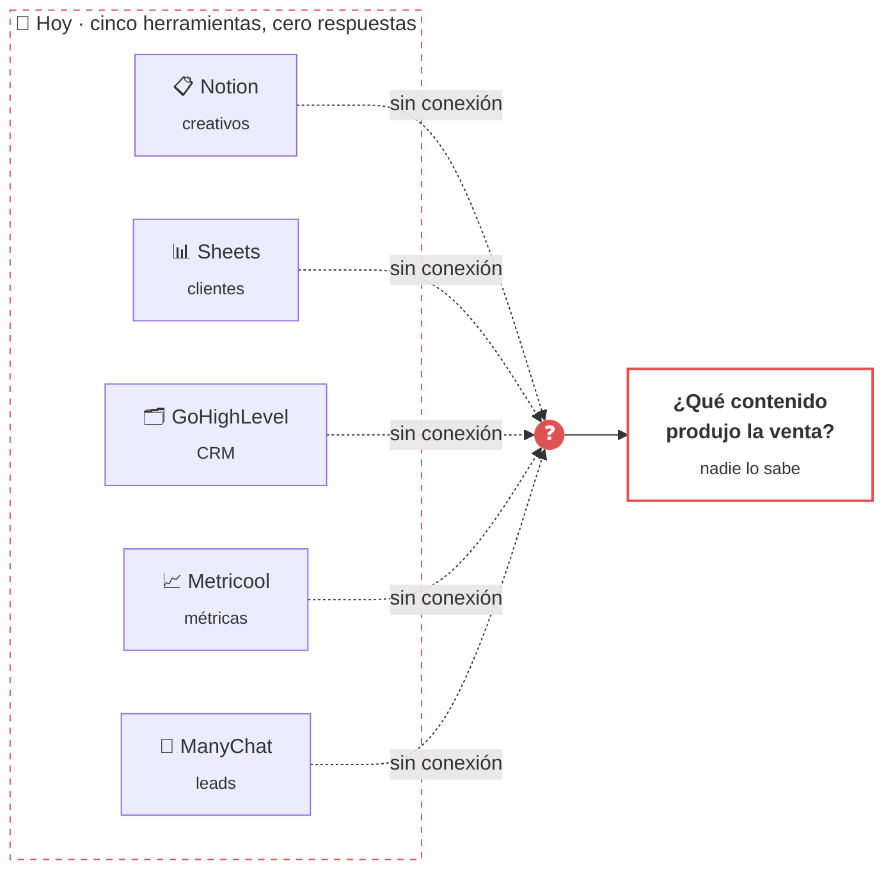
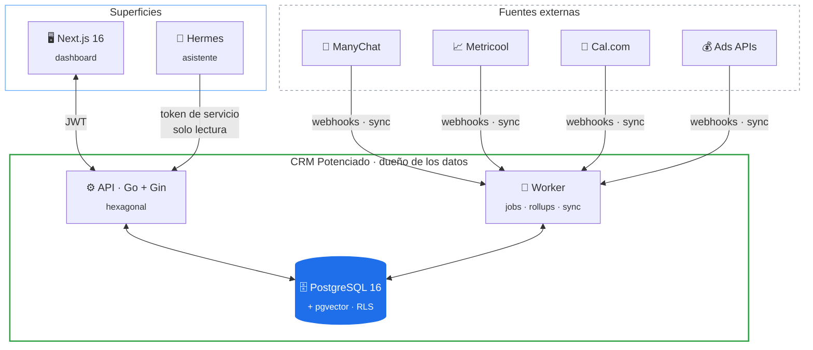
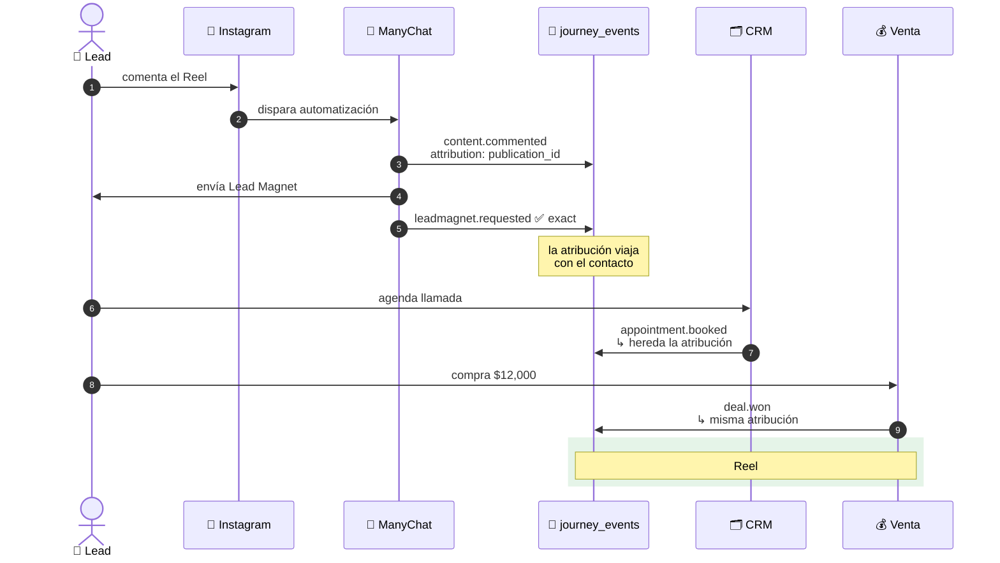
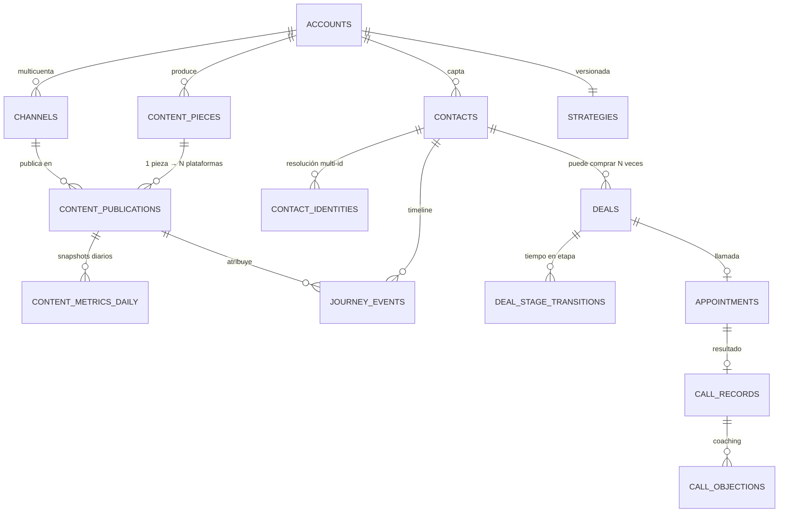
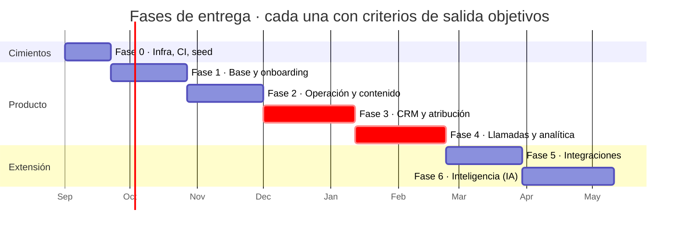
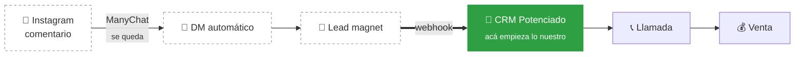

<div align="center">

# CRM Potenciado

**Una capa central de información para negocios liderados por contenido.**

Un dashboard por cliente que conecta contenido → lead → llamada → venta,
y responde la pregunta que ninguna herramienta suelta puede responder:
*¿qué pieza de contenido produjo qué venta?*

<br>


<br>


</div>

---

## El problema

Un negocio que vende por contenido opera hoy sobre herramientas que no se hablan entre sí.
Cada una responde su pedazo, ninguna responde el conjunto.



Metricool sabe que el reel tuvo 12,400 views. ManyChat sabe que alguien pidió un lead magnet.
GoHighLevel sabe que se cerró una venta de $12,000. **Nadie sabe que son la misma persona.**

---

## La solución

El dashboard es dueño de los datos. Las plataformas externas pasan a ser fuentes.



---

## La idea central: el log de atribución

Cada interacción se agrega a **un único log inmutable**. Eso es lo que convierte
métricas de vanidad en atribución de ingresos.



<details>
<summary><b>¿Por qué un log y no columnas de estado?</b></summary>

<br>

Las columnas de estado registran *dónde está* un contacto. El log registra *cómo llegó ahí*.

| Pregunta | Columnas de estado | Log de eventos |
|---|:---:|:---:|
| ¿Cuántos leads tengo? | ✅ | ✅ |
| ¿Qué hook generó más leads? | ❌ | ✅ |
| ¿Cuánto tarda alguien en comprar? | ❌ | ✅ |
| Historial completo de tags de un contacto | ❌ | ✅ |
| ¿Qué contenido produjo ingresos? | ❌ | ✅ |
| ¿Qué ángulo debería seguir usando? | ❌ | ✅ |

Cada atribución guarda su **nivel de confianza** (`exact · inferred · weak · none`).
Los reportes excluyen lo que esté por debajo de `inferred` y muestran cuántos eventos
quedaron fuera. Nunca se presenta una suposición como un hecho.

Detalle completo en [02 · Modelo de dominio](docs/02-modelo-de-dominio.md#la-columna-vertebral-journey-events).

</details>

---

## Modelo de datos, en corto



> [!IMPORTANT]
> **Pieza ≠ Publicación.** Un reel en Instagram + TikTok + Shorts es **una** idea creativa
> con **tres** publicaciones. Modelarlo como tres filas triplicaría cada métrica y haría
> imposible responder "qué contenido vendió más". El hook y el ángulo viven en la pieza;
> las métricas viven en la publicación.

---

## Roadmap



<details>
<summary><b>Qué entra en cada fase</b></summary>

<br>

| Fase | Entrega | Criterio de salida |
|---|---|---|
| **0** | Repo, migraciones, CI, seed, logging | `make up && make migrate && make seed && make test` desde un clon limpio |
| **1** | Auth, RBAC, RLS, cuentas, onboarding, estrategia | Un test prueba que la cuenta A no lee datos de la B por ningún endpoint |
| **2** | Contenido H–C–CTA, calendario, tareas, equipo, SOPs | Un reel recorre IDEA → PUBLICADO con URL por plataforma |
| **3** | Contactos, tags, pipelines, deals, **journey events** | Un webhook de ManyChat crea un contacto con atribución exacta; reenviarlo no duplica |
| **4** | Citas, recordatorios, objeciones, KPIs, dashboard financiero | Todos los KPIs coinciden con un cálculo hecho a mano sobre el seed |
| **5** | Cal.com, ManyChat, Metricool, ads | Cada integración se conecta, revoca y reconecta desde la UI |
| **6** | Asistente Hermes, RAG, análisis de llamadas | Un red team prueba que la cuenta A no accede a datos de la B |

Las fases **3 y 4 son el camino crítico**: son las que entregan la promesa del producto.

</details>

---

## Documentación

> Todo el diseño está escrito **antes** de la primera línea de código.
> Estos documentos son el contrato contra el cual se construye.

<table>
<tr><td width="60"><b>#</b></td><td width="280"><b>Documento</b></td><td><b>Responde</b></td></tr>
<tr><td>00</td><td><a href="docs/00-vision-de-producto.md">Visión y límites</a></td><td>Qué construimos y qué <b>deliberadamente no</b></td></tr>
<tr><td>01</td><td><a href="docs/01-alcance-y-fases.md">Alcance y fases</a></td><td>Qué sale primero, con criterios objetivos</td></tr>
<tr><td>02</td><td><a href="docs/02-modelo-de-dominio.md">Modelo de dominio</a></td><td>Contextos, agregados, invariantes</td></tr>
<tr><td>03</td><td><a href="docs/03-arquitectura.md">Arquitectura</a></td><td>Hexagonal, workers, patrón inbox</td></tr>
<tr><td>04</td><td><a href="docs/04-stack-tecnologico.md">Stack tecnológico</a></td><td>Cada elección y su razonamiento</td></tr>
<tr><td>05</td><td><a href="docs/05-base-de-datos.md">Base de datos</a></td><td>~40 tablas, índices, particionado, RLS</td></tr>
<tr><td>06</td><td><a href="docs/06-multitenancy-auth-rbac.md">Multi-tenancy y RBAC</a></td><td>7 roles, matriz de permisos completa</td></tr>
<tr><td>07</td><td><a href="docs/07-integraciones.md">Integraciones</a></td><td>Qué se integra y <b>qué hay que verificar antes</b></td></tr>
<tr><td>08</td><td><a href="docs/08-hermes-capa-ia.md">Hermes como IA</a></td><td>Para qué sí y <b>para qué nunca</b></td></tr>
<tr><td>09</td><td><a href="docs/09-analitica-y-metricas.md">Analítica</a></td><td>Cada KPI con su fórmula exacta</td></tr>
<tr><td>10</td><td><a href="docs/10-migracion-de-datos.md">Migración</a></td><td>Notion, Sheets y GHL sin perder datos</td></tr>
<tr><td>11</td><td><a href="docs/11-no-funcionales.md">No funcionales</a></td><td>Seguridad, performance, backups, deploy</td></tr>
<tr><td>12</td><td><a href="docs/12-riesgos-y-preguntas-abiertas.md">Riesgos</a></td><td>5 bloqueantes · 8 riesgos</td></tr>
</table>

Las decisiones de arquitectura se registran en [`docs/adr/`](docs/adr/).

---

## Stack

<table>
<tr>
<td valign="top" width="33%">

**Backend**

`Go 1.23+` · `Gin`
`pgx/v5` · `sqlc`
`goose` · `slog`
`testcontainers-go`

Hexagonal, un binario
en dos modos: `api` y
`worker`.

</td>
<td valign="top" width="33%">

**Frontend**

`Next.js 16` · `React 19`
`TypeScript strict`
`Tailwind v4` · `shadcn/ui`
`TanStack Query` · `Biome`

Container / presentational,
tipos generados desde
OpenAPI.

</td>
<td valign="top" width="33%">

**Datos e IA**

`PostgreSQL 16`
`pgvector` (HNSW)
`Hermes Agent`
`Docker` · `Caddy`

Una sola base. RLS en
toda tabla con tenant.
Postgres es también
la cola de jobs.

</td>
</tr>
</table>

<details>
<summary><b>Lo que deliberadamente NO se usa</b></summary>

<br>

| Descartado | Por qué |
|---|---|
| Redis | Postgres resuelve la cola; no hay presión de caché |
| Kafka / RabbitMQ | El volumen no justifica el costo operativo |
| Microservicios | Un equipo, un deploy. Los contextos se fuerzan con límites de paquete, no de red |
| GraphQL | Un frontend conocido; REST + generación tipada es más simple |
| ORM (gorm / ent) | sqlc da queries tipadas con el SQL a la vista |
| Base vectorial dedicada | Miles de chunks no justifican un segundo sistema |
| Event sourcing completo | El journey log es auditoría, no la fuente de verdad del estado |

Cada descarte es reversible con un [ADR](docs/adr/) que explique qué falló.

</details>

---

## Límites del producto

> [!WARNING]
> **Esto no reemplaza a Metricool ni a ManyChat, y no lo intenta.**



**Hermes Agent no puede reemplazar a ManyChat.** Sus 21 plataformas de gateway
(`telegram`, `discord`, `slack`, `whatsapp`, `email`, `sms`, `teams`, `matrix`…)
**no incluyen Instagram**, y el funnel arranca exactamente ahí: comentario en Reel → DM.
Reemplazarlo significaría integrarse directo con la Instagram Messaging API de Meta,
con App Review de por medio. Es un proyecto aparte, con riesgo regulatorio externo.

Hermes se usa para lo que sí hace bien: **el asistente, el análisis de transcripciones
y el cron de reportes**. Nunca para calcular KPIs — un número que cambia entre dos
ejecuciones no sirve para decidir dinero.

Detalle en [08 · Hermes como capa de IA](docs/08-hermes-capa-ia.md).

---

## Estado

```
Fase 0 ░░░░░░░░░░░░░░░░░░░░   0%   ← acá estamos
Fase 1 ░░░░░░░░░░░░░░░░░░░░   0%
Fase 2 ░░░░░░░░░░░░░░░░░░░░   0%
Fase 3 ░░░░░░░░░░░░░░░░░░░░   0%
Fase 4 ░░░░░░░░░░░░░░░░░░░░   0%
Fase 5 ░░░░░░░░░░░░░░░░░░░░   0%
Fase 6 ░░░░░░░░░░░░░░░░░░░░   0%
```

> [!CAUTION]
> **No se escribe código hasta que los 5 bloqueantes tengan respuesta.**

| # | Bloqueante | Bloquea |
|---|---|---|
| **B1** | ¿Metricool tiene una API utilizable en el plan del cliente? | Fase 5 |
| **B2** | ¿El plan de ManyChat incluye External Request? | Fase 3 |
| **B3** | ¿Dónde vive Postgres: self-hosted o administrado? | Fase 0 |
| **B4** | Consentimiento y retención de grabaciones de llamada | Fase 4 |
| **B5** | ¿Quién es el primer cliente y qué funnel usa? | Planificación |

Contexto completo en [12 · Riesgos y preguntas abiertas](docs/12-riesgos-y-preguntas-abiertas.md).

---

## Estructura

```
crm-potenciado/
├── docs/                    📚 el contrato de diseño (13 documentos)
│   ├── 00 … 12              cada uno responde una pregunta
│   └── adr/                 registros de decisión
├── backend/                 ⚙️  Go · hexagonal          (fase 0)
├── frontend/                🖥️  Next.js 16              (fase 1)
└── deploy/                  🐳 compose · Caddy          (fase 0)
```

---

<div align="center">
<sub>

**Planeación primero, código después.**
El diseño equivocado a alta velocidad sigue siendo el diseño equivocado.

</sub>
</div>
